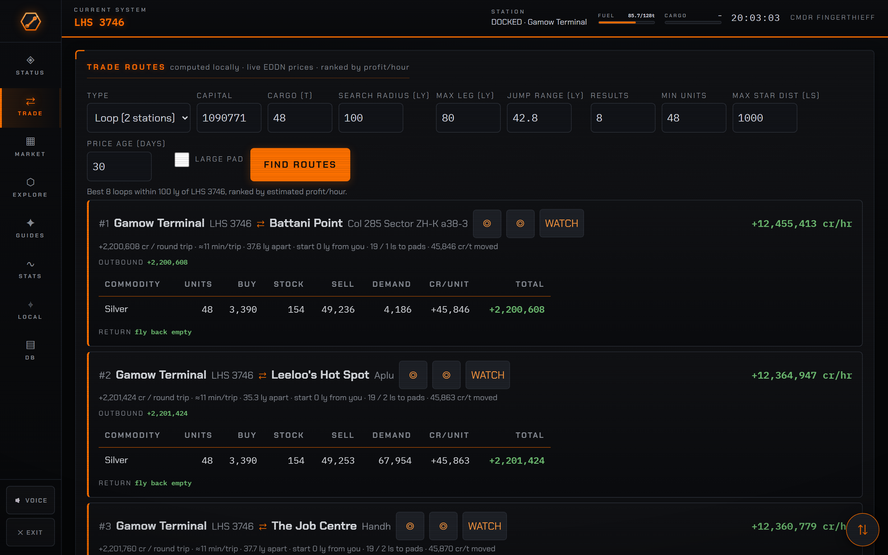
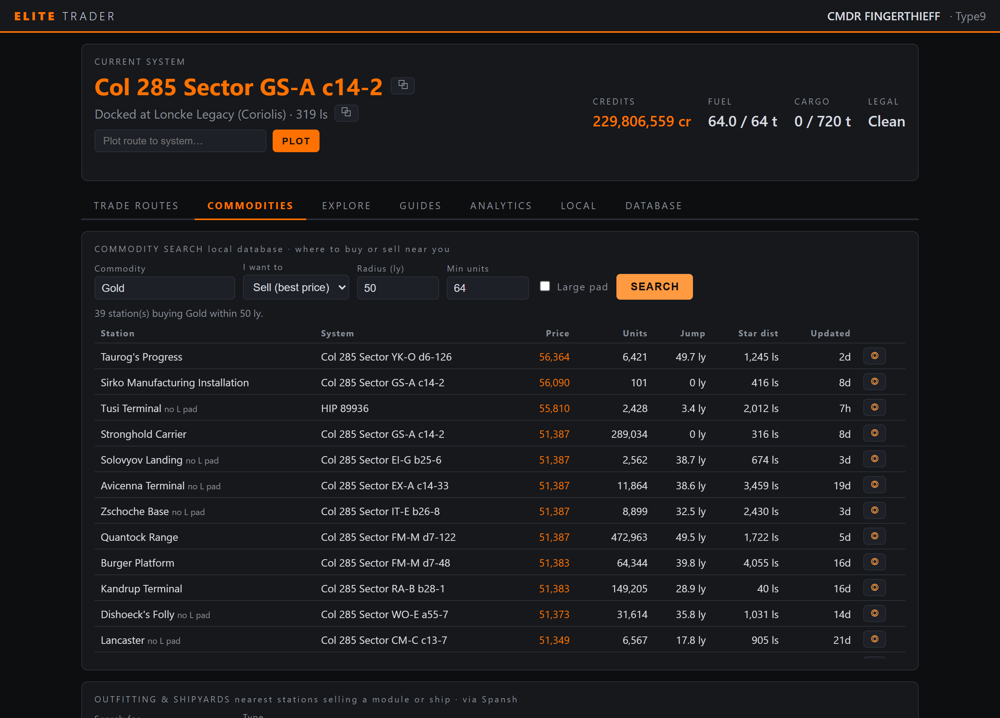
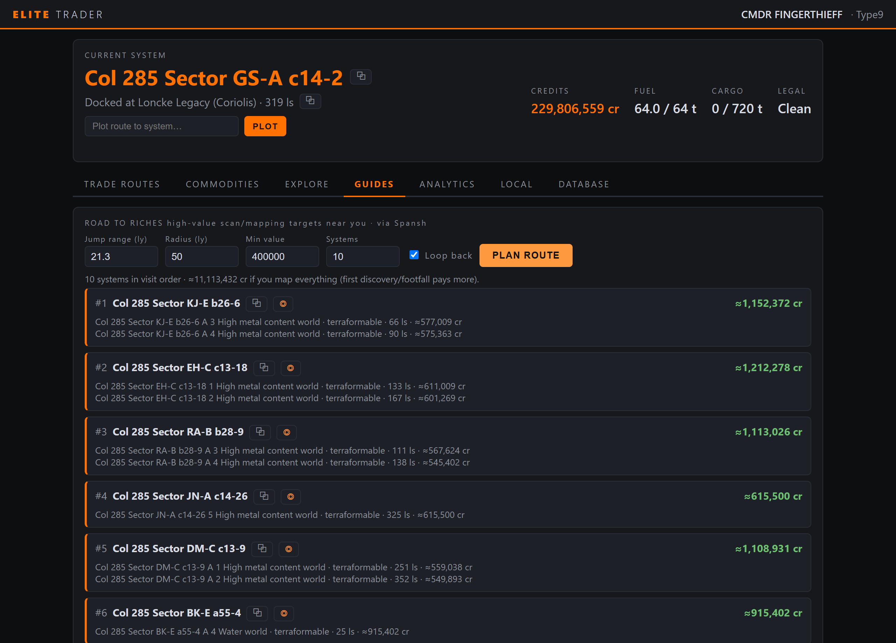
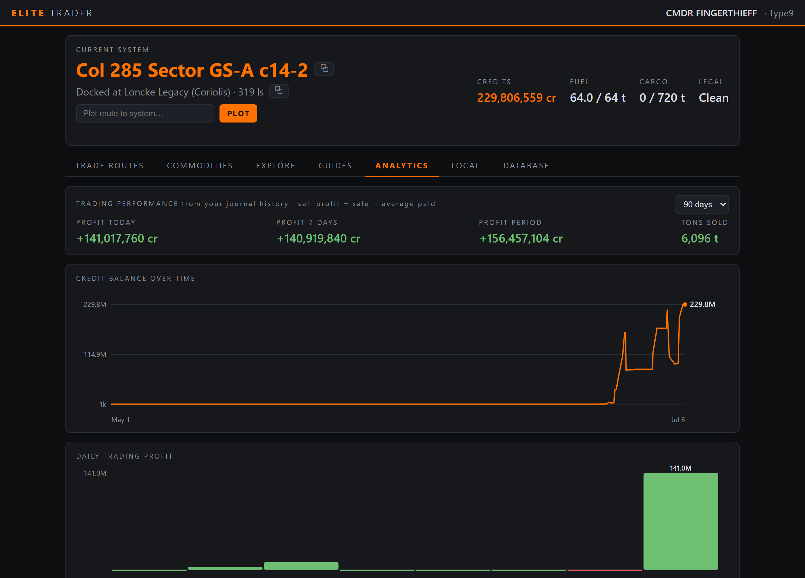
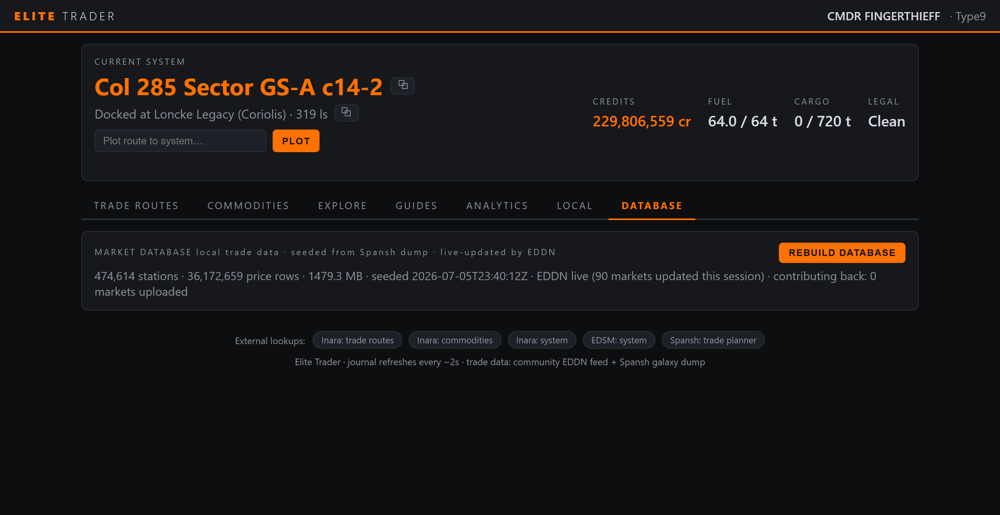
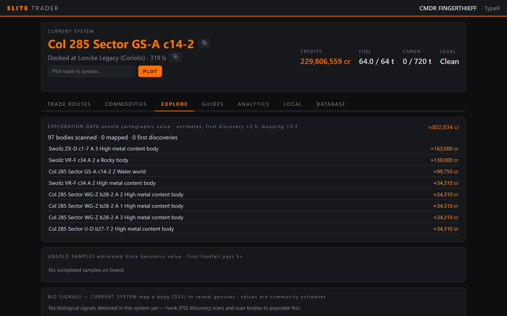
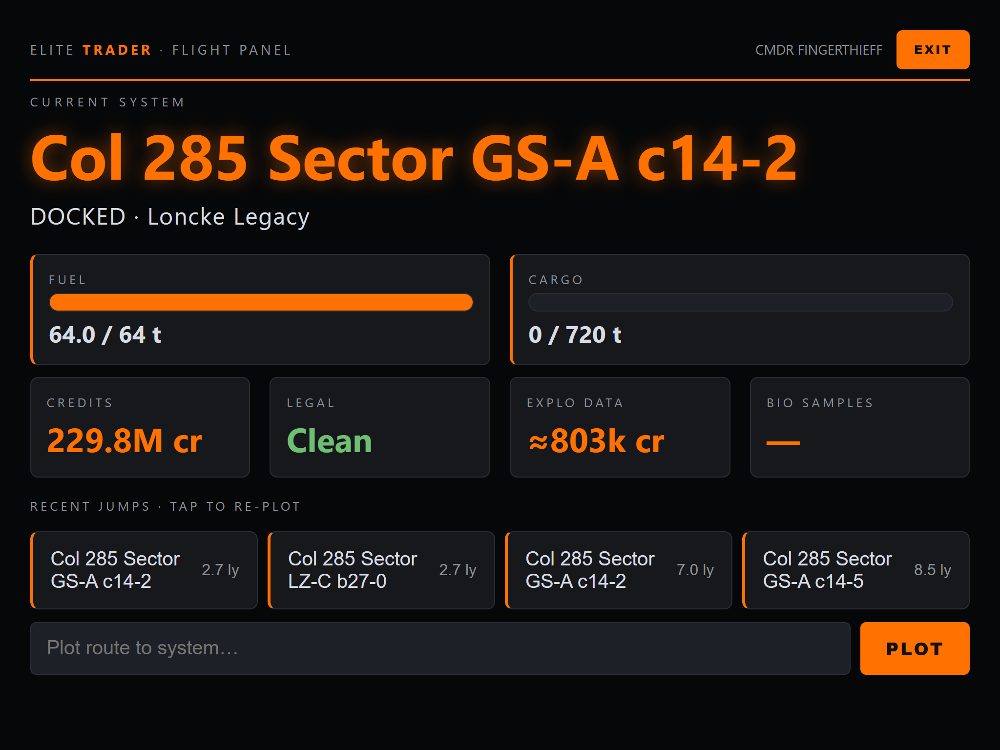
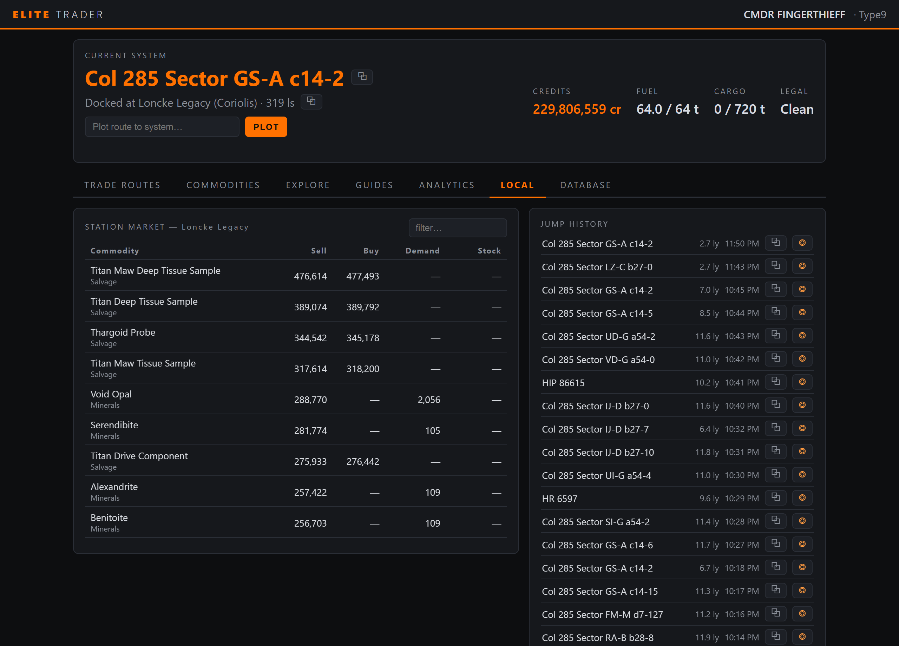

<div align="center">


Reads the game's journal live · builds its own 36-million-price market database from
the same open data Inara & Spansh use · finds profit-per-hour trade loops · plots
routes directly in the in-game galaxy map · serves every screen to your phone or
tablet over your home network.


> **Disclaimer:** this codebase was AI-generated with **Claude (Fable 5)**, directed
> and play-tested by me against my own live game. It's a personal project built for
> my own use — shared as-is, and anyone is welcome to use it.



</div>

## Standing on the shoulders of the community ❤️

None of this would be possible without the people and projects that keep Elite
Dangerous' third-party ecosystem alive. Elite Trader is a consumer of their
work, and they deserve the credit first:

- **[EDDN](https://github.com/EDCD/EDDN)** (Elite Dangerous Data Network) — the
  community's live market-data relay. Every fresh price in this app arrives via
  EDDN, and the app **contributes back**: markets you dock at are published to
  the network (the same way EDMC does), keeping it alive for everyone.
- **[Spansh](https://spansh.co.uk)** — the daily galaxy dumps that seed the
  local market database, the route-planning APIs behind the neutron plotter,
  Road to Riches and the exobiology route, and the community body data that
  shows you what's on a planet before you land.
- **[Inara](https://inara.cz)** — the encyclopedia of the galaxy; pre-filled
  links throughout the app and the engineering references in the guides.
- **[EDSM](https://www.edsm.net)** — system data links.
- **[EDCD](https://edcd.github.io/)** — the community developer collective whose
  schemas and conventions make interoperability possible.

Not affiliated with Frontier Developments. Elite Dangerous is a trademark of
Frontier Developments plc.

## What it does

### 🔁 Trade loops, ranked by profit per hour

Inara-style two-station round trips computed **on your machine** against live
prices. Each loop shows cr/hr, cr/trip, minutes per trip, and a full commodity
breakdown — units, buy/sell, **station stock and demand** (thin stock flagged red),
and profit per unit. A loop several jumps away outranks a mediocre one next door,
because relocating is a one-time cost. Search radius, leg length, jump range,
minimum stock and result count are all configurable and persist between sessions.
A multi-hop chain mode is included too.

### 🔔 Live route alerts

WATCH any loop and the app checks every incoming EDDN update against it: if the
sell price drops, the buy price rises, or demand/stock drains below your load,
you get an alert (and a browser notification) **before** wasting a trip. Only
possible because the database is live.

### 🔍 Commodity, outfitting & ship search

Where to buy or sell anything near you — best price first, with distance, units
available, pad size and price age. One click plots the route in game. A
**"WHERE TO SELL?"** button ranks the best buyers for whatever is in your hold
right now, and an outfitting/shipyard search finds the nearest station selling
any module ("6A Fuel Scoop") or ship.

<div align="center"></div>

### ⛏️ Mining advisor

What's actually worth mining right now, from *your* live market data: every
mineable commodity ranked by the best sell price near you, tagged core or laser,
with the closest buyer and its demand. Tap ◇ on any mineral and it finds the
**nearest ring hotspots** for it (community-mapped via Spansh) — count, distance,
station-distance and reserve level — one tap from plotting there. The full loop
in one place: what to mine, where to mine it, and where to sell it.

### 🧭 Guides

A curated hub of routes, planners and references:

- **Exobiology Route** — the live "Billionaire's Boulevard": the nearest
  landable, low-gravity worlds packed with high-value biology (Stratum
  Tectonicas and friends), ranked by distance with an estimated payout, the
  genera on each body, and one-tap plot + route tracking. Location-aware, so it
  works from wherever you are — not a fixed list. **Filter by genus** with one
  tap (chips for Stratum, Bacterium, Osseus, …) and the route only returns
  worlds hosting what you're farming.
- **Road to Riches** — high-value scan/mapping targets near you in visit order.
- **Neutron highway plotter** for long-range travel.
- **Reference guides** — quick pointers to engineering unlocks, material traders,
  Guardian sites and tech-broker modules.
- **Ship builds** — starting points by role (exploration, exobiology, mining,
  trading, combat), open straight in EDSY / Coriolis.

Every route waypoint is one click from the in-game galaxy map.

<div align="center"></div>

### 📈 Profit analytics & live session

Every buy/sell from your entire journal history feeds an analytics tab: profit
today / this week / this period, credits-over-time curve, daily profit bars and
your top commodities by profit. A **live session tracker** (also on the flight
panel) shows what you've earned since you launched the game — net credits,
**credits per hour**, jumps, distance and tons hauled, updating in real time. An
**earnings-by-source** breakdown unifies every income stream — trade profit
alongside missions, bounties, exploration and exobiology sales — so you can see
where your money actually comes from.

<div align="center"></div>

### 🎫 Mission board & materials

Active missions from your journal in one place: kind, faction, destination
(one-click plot), reward, a **live expiry countdown**, and a **cargo-match
warning** when you're not carrying what a delivery needs. Your engineering
**materials** inventory (raw / manufactured / encoded) is tracked too.

### 🗺️ Route progress tracking

Hit **◈ TRACK** on any neutron plot, Road to Riches route or multi-hop trade
chain and a progress banner follows you as you fly it — current waypoint, a
progress bar, and one-tap plot for the next hop. It **auto-advances as you jump**
and survives reloads, so you always know where you are in a long route.

### 🏗️ Colonization helper

Construction depots you've visited show their remaining resource needs, the
payout for delivering them, and the cheapest nearby sources for each commodity.

### 🎯 Autoplot (Windows)

Click ◎ next to any system anywhere in the app: Elite Trader focuses the game,
opens the galaxy map with your own keybinds, types the system into search and
plots the route — then **verifies it actually worked** against the game's
`NavRoute.json` instead of hoping.

### 📡 A market database that stays fresh

One click downloads Spansh's daily galaxy dump (~4 GB, deleted after import) into
a ~1.5 GB SQLite database: **474k station markets, 36M prices**. From then on the
community **EDDN** live feed updates prices in real time — when any player in the
galaxy docks, your database knows the new prices within seconds.

<div align="center"></div>

### 🧬 Exploration & exobiology

The **Explore** tab tracks your unsold cartographic data (per-body value
estimates with first-discovery and mapping bonuses) and your exobiology run:
biological signals on every scanned body (with genus value ranges and the
sample-spacing distance), live sampling progress, and the unsold samples you're
carrying with their estimated Vista Genomics payout. First footfall pays 5× on
top. When you arrive in a system, **genuses other commanders have already
mapped** are pulled from Spansh and shown immediately (◇) — so you know what's
worth landing for before you honk — with **predicted genus candidates** from
atmosphere/temperature/gravity as a fallback where nobody's mapped yet. Your own
DSS scans always take precedence.

<div align="center"></div>

### 🖥️ Flight panel mode

Tap **◈ PANEL** and the whole UI transforms into a touch-first, Elite-themed
cockpit display for a tablet mounted at your flight station: glowing system
readout, fuel and cargo gauges, credits/legal/exploration tiles, recent jumps as
big tap-to-replot buttons and a one-line route plotter. **Everything from the
standard mode is still there** — a fixed bottom touch bar (or swiping left/right,
with the page sliding under your finger) moves between Status, Trade, Market,
Explore, Guides, Stats, Local and Database pages — and **every page is themed as
a cockpit MFD**: orange rails, glowing letter-spaced readout labels, chunky
solid controls and touch-sized tables, so the whole app looks like it belongs on
your dashboard, not just the status screen. A **one-tap "best loop from here"**
finds the top trade loops around you without touching a single form field, and
optional **voice callouts** speak vital warnings — fuel-scoop and low-fuel
alerts along your plotted route (so a dry stretch of non-scoopable stars never
strands you), interdictions, hull damage, first-discovery systems — plus route
confirmations and waypoint arrivals, for a display you're not looking at. Goes
fullscreen where the browser allows; remembers the mode and page per device.

<div align="center"></div>

### 🧩 Arrange mode — make every page yours

Tap **⇅ ARRANGE** (next to the tabs, or the floating ⇅ button in panel mode)
and every card collapses to a compact header with a drag handle: drag them into
whatever order suits how you play — bio signals on top of Explore, jump history
first in Local, whatever you like. Works with touch or mouse, in both normal and
panel mode, and each page's layout is **remembered per device**, so the tablet
at your flight station and your desktop can be arranged differently.

### 🚀 Live ship & local data

Current system, station, credits, fuel, cargo and legal state ~2 s behind the
game; the docked station's full market table — with **▲/▼ price-trend arrows**
showing how each price has moved since the community last reported it — plus
jump history and cargo hold, copy buttons everywhere and pre-filled
Inara/EDSM/Spansh links in the footer.

<div align="center"></div>

---

## Quick start (Windows)

Requires Python 3.10+.

```
git clone <this repo>
cd elite-trader
run.bat
```

`run.bat` creates a virtual environment, installs dependencies and starts the app.
The desktop window opens; the LAN URL (e.g. `http://192.168.1.65:8666`) is printed
at startup for other devices. `run.bat --headless` runs the server without a window.

Allow the Windows Firewall prompt on **Private networks** if you want LAN access.

Prefer no Python at all? Grab **`EliteTrader.exe`** from the
[Releases](../../releases) page, or build it yourself with `build_exe.bat`.
The exe keeps its database in a `data\` folder next to itself, and **updates
itself** — when a new release ships it offers a one-click "Update & restart",
with the **release notes readable right in the app** before you apply
(checksum-verified; opt out in Settings or with `ET_AUTO_UPDATE=0`).

**Journal detection is automatic** — including a relocated `Saved Games`
folder (resolved via the Windows known-folder API). If it still can't find your
journals, a banner points you to **Settings → Journal folder**, where you can
paste a path with live validation; it takes effect immediately, no restart. If
the folder doesn't exist yet (game not run since install), the app picks it up
by itself the moment it appears.

## Quick start (Linux / Steam Deck)

The game runs under Steam Proton; the app runs natively with Python 3.10+:

```
git clone <this repo>
cd elite-trader
chmod +x run.sh
./run.sh --headless
```

Then open the printed URL in any browser (same machine or LAN). Notes:

- **Journals and bindings are auto-detected** inside the Proton prefix
  (`~/.local/share/Steam/steamapps/compatdata/359320/pfx/...` and the `~/.steam`
  variants). If your Steam library lives elsewhere, set the journal folder in
  **Settings → Journal folder** (live-validated, no restart) or point
  `ED_JOURNAL_DIR` at it.
- **Headless + browser is the recommended mode.** The desktop window works too,
  but pywebview needs GTK/WebKit system packages
  (e.g. Debian/Ubuntu: `sudo apt install python3-gi gir1.2-gtk-3.0 gir1.2-webkit2-4.1`).
- **Autoplot is Windows-only for now** (it injects keystrokes into the game
  client); the plot buttons report this cleanly on Linux. Everything else works
  fully.

## First run: build the market database

Open the **Database** tab and click **Build Database** once:

1. Downloads Spansh's daily galaxy dump (~4 GB, deleted after import).
2. Imports every station market into `data/market.db` (~15 minutes).
3. The EDDN live feed keeps it fresh in real time while the app runs.

The app also **contributes back**: markets you visit are published to EDDN (the
same way EDMC does), keeping the network alive for everyone. Set
`ET_EDDN_UPLOAD=0` to opt out.

Until then, trade routes fall back to the Spansh API. Rebuild any time from the
same button.

## Autoplot requirements

Autoplot drives the game with emulated keystrokes using your own key bindings.
These actions need **keyboard** keys bound (controller-only binds won't work):
*Galaxy Map*, *UI Up*, *UI Down*, *UI Right*, *UI Select*, *UI Back*. Leave the
game untouched for the ~15 s a plot takes. Timing constants live at the top of
`elite/autoplot.py`; plotting to the system you're already in always fails (the
game refuses it).

## Configuration

Day-to-day options live in the app: **Settings** (Database tab) covers the
journal folder, EDDN contribution, fleet-carrier/surface filtering and auto
updates — all applied immediately. Environment variables remain for the rest:

| Env var          | Meaning                          | Default |
|------------------|----------------------------------|---------|
| `ET_PORT`        | HTTP port                        | `8666`  |
| `ET_DATA_DIR`    | Database folder                  | `data/` next to the app |
| `ED_JOURNAL_DIR` | Journal folder override          | auto-detected; the in-app setting wins |
| `ED_BINDINGS_DIR`| Key bindings folder override     | auto-detected (Windows / Proton) |
| `ED_PLOT_KEY`    | Autoplot hold-key override       | `UI_Select` bind, then Enter |

## Releases

To cut a release (maintainer): tag and push — GitHub Actions builds the exe,
smoke-tests it and publishes the release with the exe attached:

```
git tag v1.0.0
git push origin v1.0.0
```

## Security note

The web server has **no authentication** — anyone on your network can see your
in-game location and credits. Fine on a home LAN; do **not** port-forward it to
the internet.

## Data sources & credits

See [Standing on the shoulders of the community](#standing-on-the-shoulders-of-the-community-%EF%B8%8F)
at the top — EDDN, Spansh, Inara, EDSM and EDCD make this app possible.
Not affiliated with Frontier Developments. Elite Dangerous is a trademark of
Frontier Developments plc.
